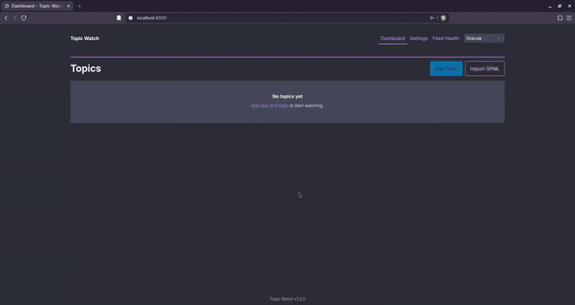

<h1 align="center">Topic Watch</h1>

<p align="center">
  <a href="https://www.gnu.org/licenses/gpl-3.0"></a>
  <a href="https://www.python.org/downloads/"></a>
  <a href="https://github.com/0xzerolight/topic_watch/releases"></a>
  <a href="https://github.com/0xzerolight/topic_watch/pkgs/container/topic_watch"></a>
  <a href="https://github.com/0xzerolight/topic_watch/stargazers"></a>
</p>

<p align="center">
Self-hosted news monitor that pings you only on genuinely new info.
</p>

<p align="center">
Please leave a ⭐ star if Topic Watch is useful - it helps others find it :).
</p>

<h3 align="center">Topic Watch Demo</h3>

<p align="center">
  
</p>

<p align="center">
Adding a topic - Topic Watch fetches the latest news and builds a per-topic knowledge baseline.
</p>

An LLM tracks a per-topic knowledge state and stays silent until something actually changes. Bring your own key, or run free against a local model.

## Install

### 1. Install Docker

Topic Watch runs in Docker. Get it at [get.docker.com](https://get.docker.com), or install [Docker Desktop](https://www.docker.com/products/docker-desktop/) on macOS/Windows. Make sure it's running before you continue.

### 2. Install Topic Watch

**Linux / macOS:**

```bash
curl -fsSL https://raw.githubusercontent.com/0xzerolight/topic_watch/main/scripts/install.sh | bash
```

**Windows (PowerShell):**

```powershell
irm https://raw.githubusercontent.com/0xzerolight/topic_watch/main/scripts/install.ps1 | iex
```

The installer asks who should be able to reach Topic Watch (this computer only, or any device on your network) and whether to start it at boot, then pulls the image, starts the container, and opens the setup wizard at [http://localhost:8000](http://localhost:8000) - set your LLM API key there.

Answer without being asked by setting `TOPIC_WATCH_BIND_ADDR` (`127.0.0.1` or `0.0.0.0`), `TOPIC_WATCH_AUTOSTART` (`yes`/`no`) or `TOPIC_WATCH_PORT` beforehand. With no terminal - a cloud-init or CI run - the installer prompts for nothing and defaults to this computer only, no autostart, port 8000.

<details>
<summary><strong>Manual install (without the script)</strong></summary>

**Docker, prebuilt image** - same image the script uses, you just supply the compose file:

```bash
mkdir -p topic-watch/data && cd topic-watch
curl -fsSL https://raw.githubusercontent.com/0xzerolight/topic_watch/main/docker-compose.prod.yml -o docker-compose.yml
(umask 077; printf 'PUID=%s\nPGID=%s\n' "$(id -u)" "$(id -g)" > .env)
docker compose up -d
```

The `.env` line matches the container's user to yours so it can write `data/`.
It is written owner-only because that file is where any secrets you add later go.

**Build from source** - no prebuilt image, builds from the Dockerfile:

```bash
git clone https://github.com/0xzerolight/topic_watch.git
cd topic_watch
(umask 077; printf 'PUID=%s\nPGID=%s\n' "$(id -u)" "$(id -g)" > .env)
docker compose up -d
```

Skip the `.env` line here and the container chowns your checkout's `data/` to
UID 1000, which takes it away from you if your own UID differs.

**Without Docker** (Python 3.11+):

```bash
git clone https://github.com/0xzerolight/topic_watch.git
cd topic_watch
python -m venv .venv && source .venv/bin/activate
pip install -e .
uvicorn app.main:app --host 127.0.0.1 --port 8000
```

Then open [http://localhost:8000](http://localhost:8000) and set your LLM key in the
setup wizard - no manual config step. Use the editable install (`-e`) so config and
the SQLite database land in the project's `data/` directory.

`--host 127.0.0.1` keeps it on this machine. Topic Watch has no login screen, so
only widen that once an authenticating reverse proxy is in front of it.

</details>

<details>
<summary><strong>Updating</strong></summary>

**If you used the install script or the prebuilt image:**

```bash
cd ~/topic-watch  # or your install directory
docker compose pull
docker compose up -d
```

Or run the updater, which reports the version change and points at your backups:

```bash
curl -fsSL https://raw.githubusercontent.com/0xzerolight/topic_watch/main/scripts/update.sh | bash
```

**If you built from source,** there is no image to pull - rebuild instead:

```bash
cd topic_watch  # your clone
git pull
docker compose up -d --build
```

The database is automatically backed up before any schema migration.

</details>

## Features

- Novelty detection: per-topic knowledge state, not keyword matching or summarization - ignores the 10th article rehashing the same story
- Any LLM via [LiteLLM](https://docs.litellm.ai/docs/providers) - OpenAI, Anthropic, Gemini, Groq, and more. BYOK, or run free and local with Ollama
- Cheap: ~$0.0003/check on GPT-5.4 Nano (under $0.20/month for 5 topics checked 4×/day), or free with Ollama
- Private and self-hosted on SQLite - no database server, no JavaScript build step. Outbound traffic only goes to RSS feeds, your LLM provider, and your notifier
- Auto feeds (Bing News, falling back to Google News), manual RSS/Atom URLs, or optional [Exa](https://exa.ai) AI semantic search per topic
- Per-topic check intervals (10 min to 6 months: `6h`, `1w 3d`, `2h 30m`) and a plain-English novelty instruction ("official announcements only, ignore rumors")
- 100+ notification services via [Apprise](https://github.com/caronc/apprise/wiki) - Discord, Slack, Telegram, email, ntfy, etc.

<details>
<summary><strong>More features</strong></summary>

- Importance scoring: every finding is rated 1-5, with an optional per-topic threshold that mutes minor findings without dropping them from the knowledge state
- Knowledge history: every update to a topic's knowledge state is kept as a revision, with an inline diff timeline showing what the AI added or removed
- Silence Heartbeat: after a few consecutive checks where no source returned anything usable, you get one "sources failing" alert per affected topic - and a recovery notice when they come back
- Custom JSON webhooks and a notification retry queue
- Feed health dashboard
- Topic tags and bulk check/delete
- Data export (JSON, CSV) and OPML import/export
- 5 color themes (Nord, Dracula, Solarized Dark, High Contrast, Tokyo Night)
- In-app settings page

</details>

<details>
<summary><strong>How It Works</strong></summary>

1. Define a topic with RSS feed URLs, let it auto-generate a news-search feed (Bing News first, Google News as fallback), or point it at Exa AI semantic search.
2. On a schedule, articles are fetched and compared against a **knowledge state** - a rolling summary of what's already known.
3. An LLM decides if anything is actually new.
4. New info -> notification with summary + sources. Nothing new -> silence.

</details>

<details>
<summary><strong>LLM providers</strong></summary>

Uses [LiteLLM](https://docs.litellm.ai/docs/providers). Anything LiteLLM supports works - the model string needs its provider prefix.

| Provider | Model String |
|----------|-------------|
| OpenAI | `openai/gpt-5.4-nano` |
| Anthropic | `anthropic/claude-haiku-4-5` |
| Ollama | `ollama/llama3.3` |
| Google Gemini | `gemini/gemini-2.5-flash` |
| Groq | `groq/llama-3.3-70b-versatile` |
| DeepSeek | `deepseek/deepseek-chat` |
| Azure OpenAI | `azure/your-deployment` |
| Cohere | `cohere_chat/command-a-03-2025` |
| Together AI | `together_ai/meta-llama/Llama-4-Maverick-17B-128E-Instruct-FP8` |

**Get an API key:** [OpenAI](https://platform.openai.com/api-keys) ·
[Anthropic](https://console.anthropic.com/settings/keys) ·
[Gemini](https://aistudio.google.com/apikey) ·
[Groq](https://console.groq.com/keys) ·
[DeepSeek](https://platform.deepseek.com/api_keys). Or skip keys entirely and run
free + local with [Ollama](https://ollama.com/download).

Ollama and OpenAI-compatible gateways (LM Studio, a LiteLLM proxy, OpenCode Go) need a
`base_url` - see [`config.example.yml`](config.example.yml).

Reaching Ollama on the host from inside the container also needs an override file.
From your install directory (`~/topic-watch` if you used the script):

```bash
curl -fsSL https://raw.githubusercontent.com/0xzerolight/topic_watch/main/docker-compose.override.example.yml -o docker-compose.override.yml
docker compose up -d
```

In a git clone the file is already there: `cp docker-compose.override.example.yml docker-compose.override.yml`.

</details>

<details>
<summary><strong>Notifications and configuration</strong></summary>

Notifications are **off by default** - Topic Watch tracks topics silently until you add
at least one [Apprise URL](https://github.com/caronc/apprise/wiki) on the **Settings**
page (`ntfy://your-topic`, `discord://webhook_id/webhook_token`, ...). Multiple URLs are
supported; **Test Notification** verifies them.

Everything else lives in `data/config.yml` (auto-copied from
[`config.example.yml`](config.example.yml) on first run) and is editable on the Settings
page. Any key can be overridden with the `TOPIC_WATCH_` env prefix, using `__` for nested
keys (e.g. `TOPIC_WATCH_LLM__API_KEY`). Full key reference:
[`config.example.yml`](config.example.yml) and [ARCHITECTURE.md](ARCHITECTURE.md).

</details>

## Security

**No built-in authentication** by design (single-user tool). Because of that, the port is published on `127.0.0.1` by default - a stock install is reachable only from the machine it runs on.

To reach it from other devices, set `TOPIC_WATCH_BIND_ADDR=0.0.0.0` in `.env` (the installer offers this as a question) and put it behind a reverse proxy with auth ([Authelia](https://www.authelia.com/), [Authentik](https://goauthentik.io/), Caddy `basicauth`, Nginx basic auth). A host firewall is not a substitute: Docker publishes ports ahead of `ufw` and `firewalld` rules. See [SECURITY.md](SECURITY.md).

## Troubleshooting

| Issue | Fix |
|-------|-----|
| **LLM errors / checks failing** | Check your API key and that the model string has its provider prefix (`openai/gpt-5.4-nano`, not `gpt-5.4-nano`). Logs: `docker compose logs -f`. |
| **No notifications** | Add an Apprise URL on the Settings page and press Test Notification. Verify the [URL format](https://github.com/caronc/apprise/wiki). |
| **0 articles found** | Open the RSS URL in a browser and check the Feed Health page. Some sites block bots. |
| **"Sources failing" alert** | Sent after `silence_heartbeat_checks` consecutive checks (default 3) with no usable source - a dead feed, an expired Exa key, or no network. Fix the source, or set `silence_heartbeat_checks: 0` to turn the alert off. |
| **Topic stuck in "Researching"** | Auto-recovers after 15 minutes (set to Error). Retry from the topic page. Usually an LLM connectivity issue. |
| **Docker container exits** | `docker compose logs` for details. Check that `data/` is writable. The installer sets `PUID`/`PGID` automatically; see [SECURITY.md](SECURITY.md). |
| **Can't reach it from another device** | The port is published on `127.0.0.1` by default. Set `TOPIC_WATCH_BIND_ADDR=0.0.0.0` in `.env` and run `docker compose up -d`. Add a reverse proxy with auth first - there is no login screen. |
| **High memory** | Lower `max_articles_per_check` or `content_fetch_concurrency`. Increase check intervals. |

Still stuck? Run `python -m app.cli doctor` (Docker: `docker compose exec topic-watch python -m app.cli doctor`) for a secret-safe diagnostic snapshot - version, runtime, redacted config, schema, and feed health - and paste it into a bug report. Update to the latest release first.

## Contributing

Contributions of any kind are welcome.

- New here? Start with [CONTRIBUTING.md](CONTRIBUTING.md).
- Architecture overview: [ARCHITECTURE.md](ARCHITECTURE.md).
- Getting help: [SUPPORT.md](SUPPORT.md).
- Security: [SECURITY.md](SECURITY.md).

Bug reports and feature requests -> [Issues](https://github.com/0xzerolight/topic_watch/issues).
Questions and discussion -> [Discussions](https://github.com/0xzerolight/topic_watch/discussions).

## License

GNU General Public License v3.0. See [LICENSE](LICENSE).
